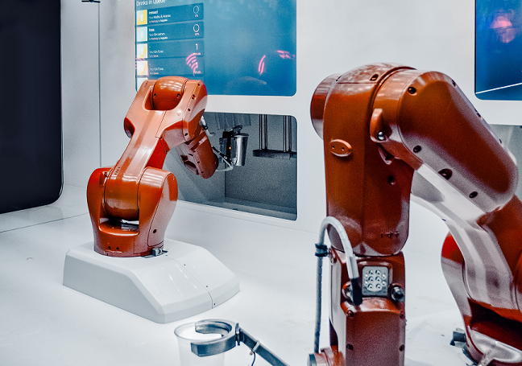

# An exploratory series on test automation for web applications (source code)

This is supplementary source code for an article at [dev.to](https://wwww.dev.to/)



Clone the repo

```shell
git clone https://github.com/bylwong/test-automation-with-python.git
```

Install required dependencies

```shell
cd test-automation-with-python
pip install -r requirements.txt
```

Run the test script

```shell
python ./test_module.py
```
